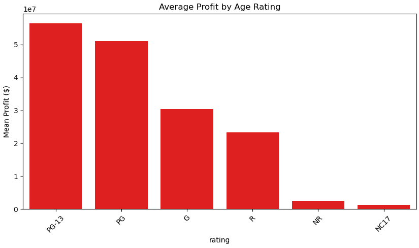
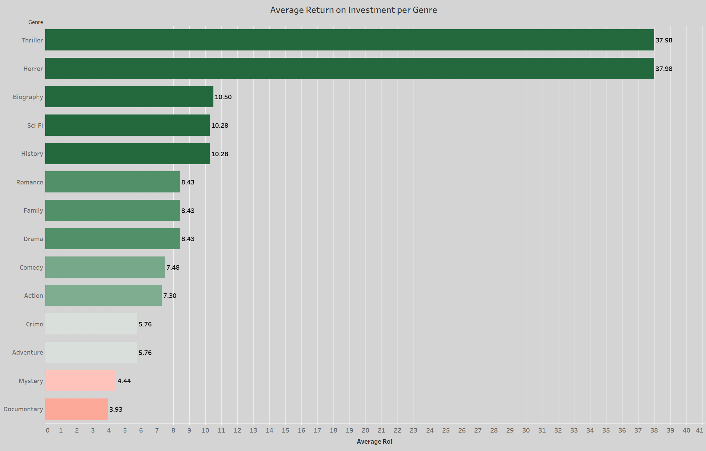
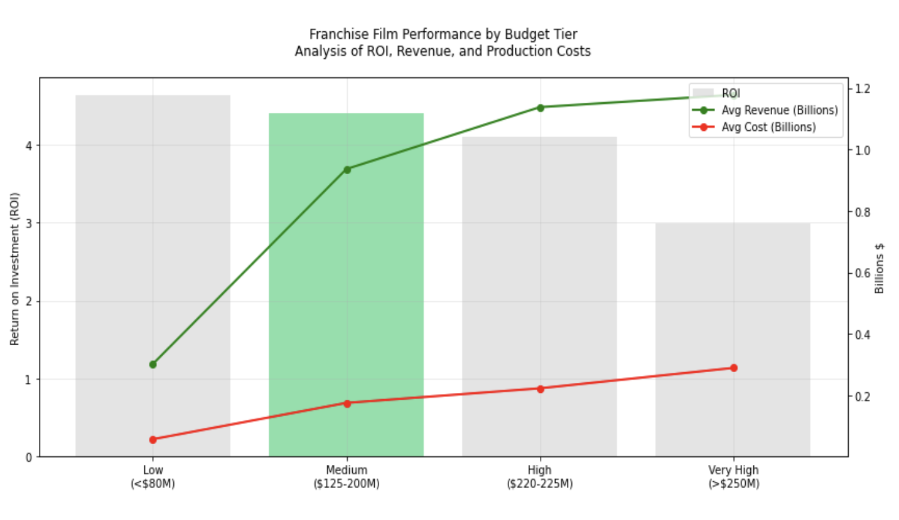
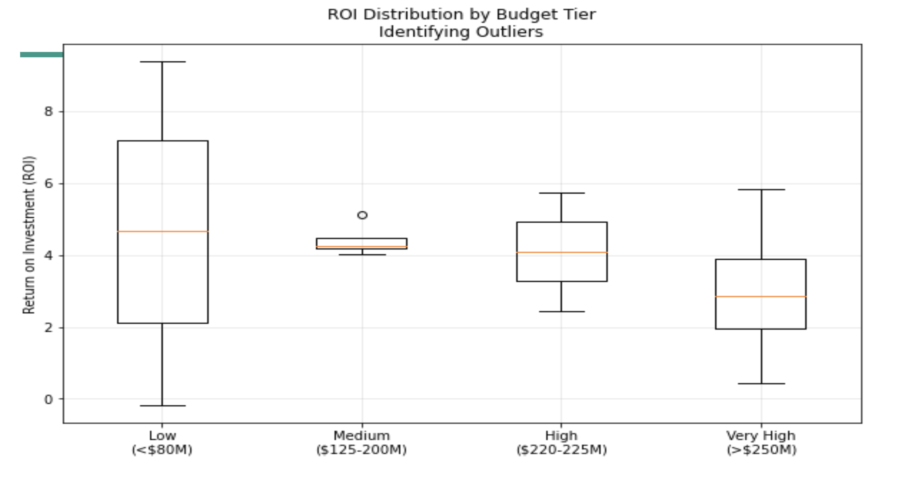
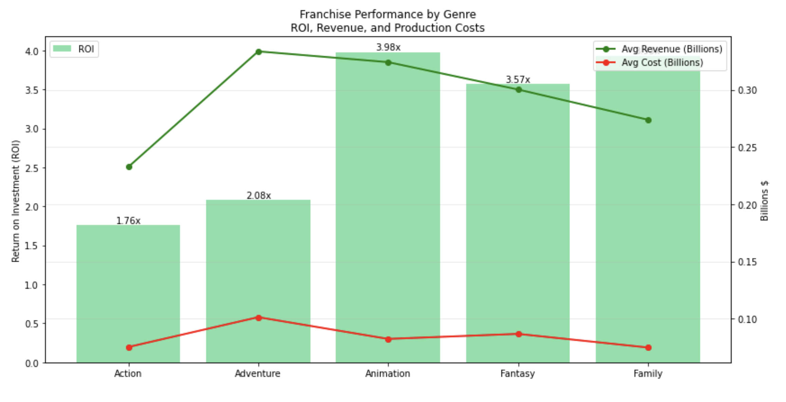

<!-- PROJECT SHIELDS -->

[![Contributors][contributors-shield]][contributors-url]
[![Activity][activity-shield]][activity-url]
<!-- [![Stargazers][stars-shield]][stars-url] -->
Eddie \
Jake \
Calvin 

<!-- TABLE OF CONTENTS -->

  
Table of Contents

  <ol>
    <li>
      <a href="#business-problem">Business Problem</a>
    </li>
    <li><a href="#data">Data</a></li>
    <li><a href="#results">Results</a></li>
    <li><a href="#conclusions">Conclusions</a></li>
    <li><a href="#next-steps">Next Steps</a></li>
  </ol>

<!-- Business Proposal -->
## Business Problem

<h3 align="center">Expanding Into the Film Industry</h3>

This project explores box office data to analyze what metrics are associated with well performing movies. The metrics we settled on are Age rating, Genre, and Franchising.

## Data
The data comes from various online databases that store information related to films, television series, and more. 
* [Box Office Mojo](https://www.boxofficemojo.com/) 
* [IMDB](https://www.imdb.com/) 
* [Rotten Tomatoes](https://www.rottentomatoes.com/) 
* [TMDB](https://www.themoviedb.org/) 
* [The Numbers](https://www.the-numbers.com/)

## Results

### PG-13 and PG tend to perform better than the other ratings, likely due to a broader audience.

### Focusing on movies with a high Return on Investment leads to around a $2 million budget

### Within a $2 million budget, thrillers and horrors performed substantially better than any other genre.

### When exploring franchised films, medium budget films have a solid ratio of ROI, revenue, and production costs

### While low budget films have a higher ROI, medium budgets films actually have the lowest variance.

### In terms of franchised films, animation and family are the best performing genres.

## Conclusions
* **PG-13 and PG movies are the age ratings to focus on** They offer the best balance of accessibility and profitability since there is a broader audience. R-rated and G-rated movies face revenue limitations due to audience restrictions. 
* **Horror and Thriller are the best performing genres with a limited budget** Before the company explores franchised films, it should focus on low budget, but high return on investment films. As such, with a 2 million dollar budget, horror and thriller are substantially higher performing than other genres, both with an average return of almost 4000%.
* **When stable enough to invest in a franchised series, medium budget films have a high revenue potential** Once the studio has had success with the low budget films, franchised series have the potential to perform very well. Medium budget films, defined as movies with a 125-200 million budget, have constitent and predictable returns compared to low budget films, which have higher returns, but are inconsistent. Within franchised series, animation and family do particularly well.

## Next Steps
Further steps
* Exploring how streamed movies compare to movies that come out in theaters
* Explore if there is a strong correlation between large advertising budget and how well a movie performs

<!-- https://home.aveek.io/GitHub-Profile-Badges/ -->

<!-- LINKS & IMAGES -->
[contributors-shield]: https://img.shields.io/github/contributors/Zxhjlk/Phase1Project.svg?style=for-the-badge
[contributors-url]: https://github.com/Zxhjlk/Phase1Project/graphs/contributors
[activity-shield]: https://img.shields.io/github/last-commit/Zxhjlk/Phase1Project?style=for-the-badge
[activity-url]: https://github.com/Zxhjlk/Phase1Project/activity

[Solidity]: https://img.shields.io/badge/Solidity-363636.svg?style=for-the-badge&logo=Solidity&logoColor=white
[Solidity-url]: https://soliditylang.org/

[Pytorch]: https://img.shields.io/badge/PyTorch-EE4C2C.svg?style=for-the-badge&logo=PyTorch&logoColor=white
[Pytorch-url]: https://pytorch.org/

[React]: https://img.shields.io/badge/React-61DAFB.svg?style=for-the-badge&logo=React&logoColor=black
[React-url]: https://react.dev/

[FastAPI]: https://img.shields.io/badge/FastAPI-009688.svg?style=for-the-badge&logo=FastAPI&logoColor=white
[Fast-url]: https://fastapi.tiangolo.com/